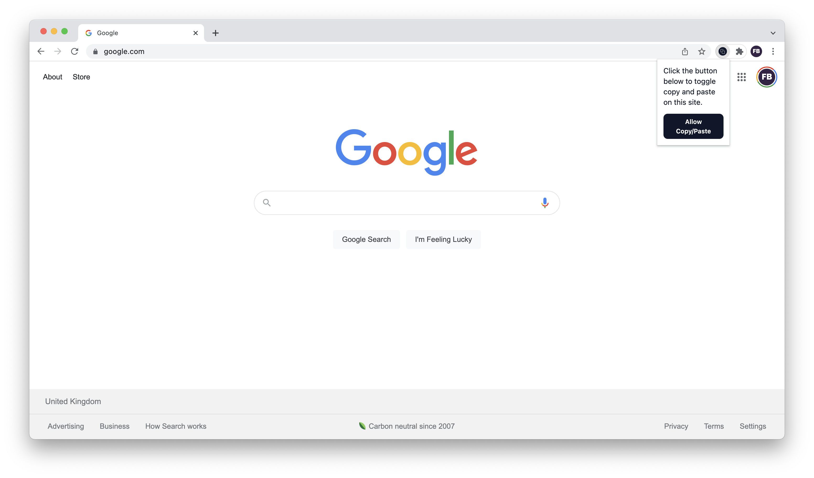

# Chrome Allow Copy/Paste

Some websites block your ability to copy and paste text and content from them, this extension works to prevent these restrictions from being added.

## Usage

When installed, by default the app can automatically block some of the simple restrictions. However to avoid the more complex ones, you'll need to open Chrome Developer Tools, select the **Allow Copy/Paste** tab and click the button to reload the page with the added scripts.

## Development

You can work on the HTML files individually using `npm install` and `npm run dev` which will start the Tailwind CLI to auto-generate your CSS.

To deploy the extension to the Chrome Web Store a zip file can be created by running `npm run build` and the output file can be found in the root directory named `chrome-allow-copy-paste.zip`.

You can also test your app locally by visiting `chrome://extensions/` and clicking **Load unpacked**. Here you can either select the **src** folder or run `npm run build-local` and select the **build** folder to see the finished extension.

## Design

In the **design** folder you can find all the assets to publish the app on the Chrome Web Store.
https://chrome.google.com/webstore/category/extensions
